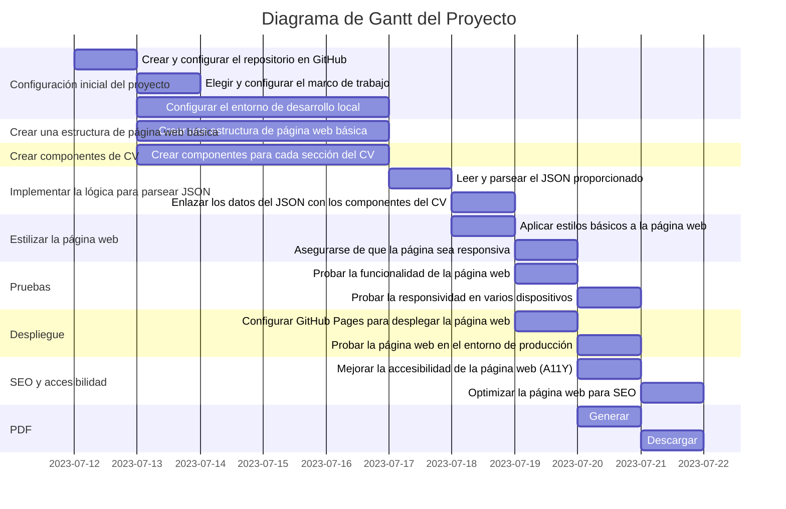
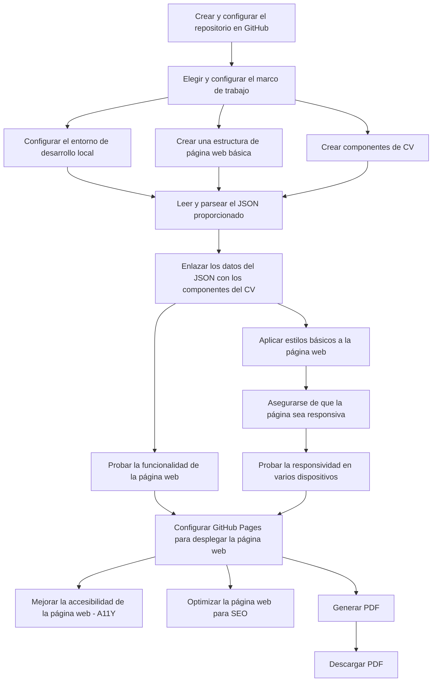

# Awesomic Sivi

## Backlog

1. Crear Lista de tareas - [mariagomezt]

    - Crear Backlog
    - Estimar tiempos
    - Definir

creame un diagrama de gantt en mermaid con la siguiente lista de tareas. la fecha de inicio es el 12-jul de 2023, la de fin el 20-jul-2023 a las 12:00. El horario de trabjo es de 9:00 a 14:00. El 13-jul y el 20 jul ademas se necesitan 2 horas para tareas administrativas

2. Configuración inicial del proyecto
    - Crear y configurar el repositorio en GitHub. [elMestre]
    - √ Elegir y configurar el marco de trabajo para el desarrollo del sitio
        - √ HTML
        - √ Vainilla JS
        - √ Vainilla CSS
    - Configurar el entorno de desarrollo local (instalar las dependencias necesarias).
    - Documento de diseño
        - Guion y diagrama casos de uso - [mmposts]
        - Gant
        - Pert
        - Requisitos

3. Crear una estructura de página web básica
    - logica [nagelit],[amoyanoglz]
    - Semantica - HTML [agusspoxe] [johanZrEND] [josedavidd]
    - Diseño [paolafdezz],[saraArbesu]
    - Crear una estructura de página web básica con cabecera, cuerpo y pie de página.

4. Crear componentes de CV [paolafdezz],[saraArbesu],[amoyanoglz]
    - Crear componentes para cada sección del CV (por ejemplo, experiencia laboral, educación, habilidades).
        - aboutMe
        - experience
            - jobs
            - publicArtifacts
        - knowledge
        - careerPreferences

5. Implementar la lógica para parsear JSON
    - Leer y parsear el JSON proporcionado. - [javiercjv]
    - Enlazar los datos del JSON con los componentes del CV.

6. Estilizar la página web
    - Aplicar estilos básicos a la página web. -
    - Asegurarse de que la página sea responsiva y se vea bien en diferentes tamaños de pantalla.

7. Pruebas
    - Probar la funcionalidad de la página web en varios navegadores.
    - Probar la responsividad en varios dispositivos.
    - Crear mas ejemplos JSON --> CV [nagelit]

8. Despliegue
    - Configurar GitHub Pages para desplegar la página web. - [manal127]
    - Probar la página web en el entorno de producción y resolver cualquier problema que pueda surgir.

9. SEO y accesibilidad
    - Mejorar la accesibilidad de la página web (A11Y).
    - Optimizar la página web para SEO.

10. PDF
    - Generar
    - Descargar

## Planning

### GANTT

### PERT

