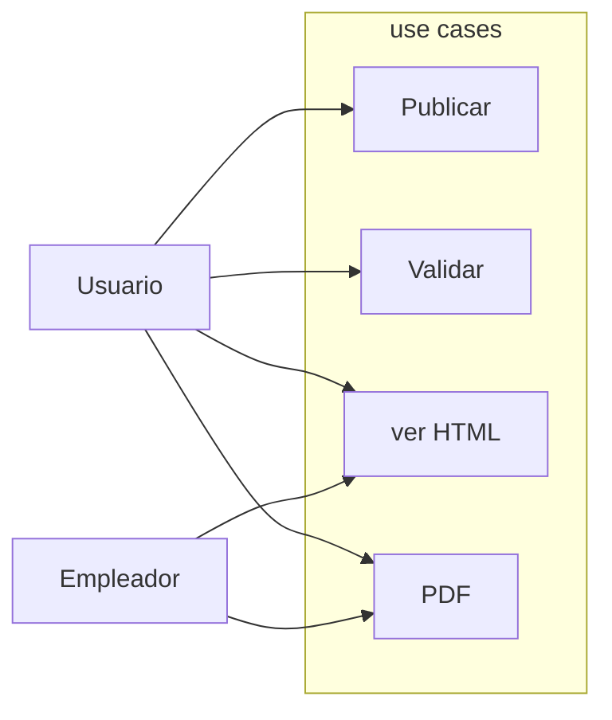

# Awesomic Sivi

## USE CASE SCRIPT

1. BRIF:
    1.1 Este proyecto esta enfocado al usuario perteneciente al ambito de la informatica y precisa elaborar su propio curroiculum profecional, poder generarlo y publicarlo para postularse. Un CV inovador creado en formato JSON.

2. ACTORS:En este caso intervienen dos figuras, que serian por su parte;
    2.1 USUARIO
    2.2 EMPLEADOR

3. PRECONDITION:
    3.1 El usuario tiene que tener un perfil el GitHub.
    3.2 Generar su curroiculum con json.

4. BASIC FLOW:
    4.1 Debe clonar el repositorio del JSON.
    4.2 Debe rellenar sus datos en el fichero.
    4.3 Debe validar el JSON, ( herramienta recomendada) [jsonlint.com](https://www.jsonlint.com/).

5. ALTERNATE FLOW:

6. EXEPTION FLOW:
    6.1 Si el JSON no se puede validar no se podra generar el CV.

7. POST CONDITION:
    7.1 Poder publicar el CV en la WEB.
    7.2 Poder descargar el CV en formato PDF, por el propio usuario opor el empleador.

### USE CASE DIAGRAM

