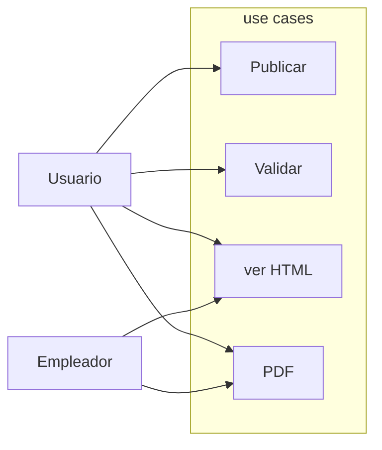

# Awesomic Sivi

## USE CASE SCRIPT

1. BRIEF:
    1. Este proyecto está enfocado al usuario perteneciente al ámbito de la informática y precisa elaborar su propio currículum profesional, poder generarlo y publicarlo para postularse. Un CV innovador creado en formato JSON.

2. ACTORS:En este caso intervienen dos figuras, que serían por su parte;
    1. USUARIO - A1
    2. EMPLEADOR - A2

3. PRECONDITION:
    1. El usuario tiene que tener un perfil en GitHub.
    2. Generar su currículum con json.

4. BASIC FLOW:
    1. Debe clonar el repositorio del JSON.
    2. Debe rellenar sus datos en el fichero.
    3. Debe validar el JSON, (herramienta recomendada) [jsonlint.com](https://www.jsonlint.com/) - C2.
    4. Ver HTML - C3.

5. ALTERNATE FLOW:

6. EXCEPTION FLOW:
    1. Si el JSON no se puede validar no se podra generar el CV.

7. POST CONDITION:
    1. Poder publicar el CV en la WEB - C1.
    2. Poder descargar el CV en formato PDF, por el propio usuario o por el empleador - C4.

### USE CASE DIAGRAM

